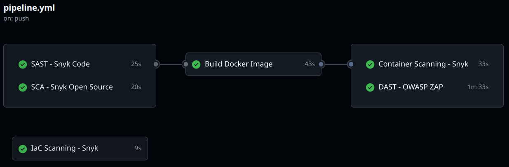

# DevSecOps Pipeline Lab

A hands-on DevSecOps pipeline that intentionally introduces security vulnerabilities into a .NET API and uses industry-standard tools to detect them automatically on every push.

Built to demonstrate security-first CI/CD practices across the full spectrum: SAST, SCA, Container Scanning, IaC Scanning, and DAST.

## What it does

Every push to `main` triggers a full security pipeline that scans for vulnerabilities at every layer of the stack:

| Stage | Tool | What it detects |
|---|---|---|
| **SAST** | Snyk Code | Hardcoded secrets, SQL injection, command injection |
| **SCA** | Snyk Open Source | Known CVEs in NuGet dependencies |
| **Container Scanning** | Snyk Container | Vulnerabilities in the Docker image and base image |
| **IaC Scanning** | Snyk IaC | Misconfigurations in docker-compose.yml |
| **DAST** | OWASP ZAP | Runtime vulnerabilities in the running API |

## Intentional Vulnerabilities

The API contains deliberate security flaws to demonstrate detection capabilities:

| Vulnerability | Location | Detected by |
|---|---|---|
| Hardcoded credentials | `Program.cs` | SAST (Snyk Code) |
| SQL Injection | `Program.cs` `/users/{username}` | SAST (Snyk Code) |
| Sensitive data exposure | `Program.cs` `/config` | SAST (Snyk Code) |
| Command injection | `Program.cs` `/execute` | SAST (Snyk Code) |
| Vulnerable dependency | `Newtonsoft.Json 9.0.1` | SCA (Snyk Open Source) |

> These vulnerabilities are intentional and exist for educational purposes only.

## Pipeline




## Tech Stack

- **.NET 10** — ASP.NET Core Minimal API
- **GitHub Actions** — CI/CD pipeline
- **Snyk** — SAST, SCA, Container Scanning, IaC Scanning
- **OWASP ZAP** — Dynamic Application Security Testing
- **Docker** — containerization

## Prerequisites

- GitHub account with Actions enabled
- Snyk account (free tier) — add `SNYK_TOKEN` as a GitHub Actions secret

## Getting Started
```bash
git clone https://github.com/emmanuelepp/devsecops-pipeline-lab.git
cd devsecops-pipeline-lab
```

Push to `main` to trigger the pipeline automatically, or run manually from the **Actions** tab in GitHub.

## Scan Reports

Each pipeline run generates artifacts:

- `snyk-sast-report` — SAST findings (SARIF format)
- `snyk-sca-report` — dependency vulnerabilities (JSON)
- `zap-scan-report` — DAST findings (HTML)

Available under **Actions → [run] → Artifacts**.

## License

MIT